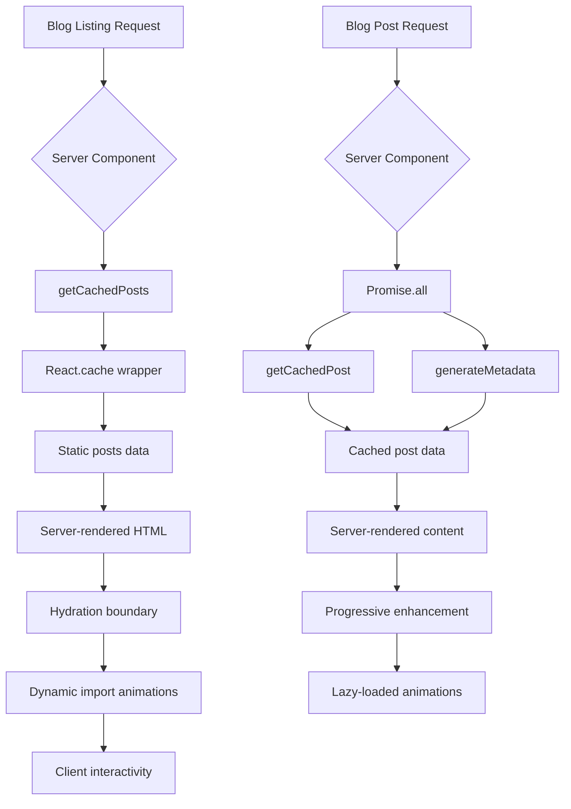

# Design Document: Blog Performance Optimization

## Overview

This design document outlines the technical approach for optimizing the blog section of the Next.js portfolio website. The optimization focuses on reducing bundle size through dynamic imports, leveraging React Server Components, implementing efficient data fetching patterns, and minimizing re-renders while preserving the Neo-Brutalist design aesthetic.

### Current State Analysis

The existing blog implementation has several performance issues:

1. **Excessive Client-Side JavaScript**: The blog listing page (`app/blog/page.tsx`) uses `"use client"` directive, forcing the entire page and its dependencies (including framer-motion) to be sent to the client
2. **Large Bundle Size**: framer-motion library (~60KB gzipped) is loaded on every blog page visit, even though animations could be progressively enhanced
3. **Suboptimal Component Architecture**: Static content (post metadata, markdown rendering) is mixed with interactive components, preventing server-side optimization
4. **Data Fetching Inefficiencies**: Blog post data is fetched multiple times without caching, and metadata generation doesn't use parallel fetching patterns
5. **Barrel Imports**: Icons and utilities are imported from barrel files (e.g., `lucide-react`), preventing effective tree shaking

### Optimization Goals

- Reduce initial JavaScript bundle size by at least 30%
- Improve First Contentful Paint (FCP) and Largest Contentful Paint (LCP) metrics
- Eliminate data fetching waterfalls
- Maintain 100% visual and functional parity with current implementation
- Preserve Neo-Brutalist design aesthetic and animation effects

## Architecture

### Component Hierarchy Restructure

The optimized architecture separates concerns between server and client components:

```
app/blog/
├── page.tsx (Server Component - default)
│   ├── BlogListingContent (Server Component - static content)
│   └── BlogListingClient (Client Component - animations & interactions)
│       ├── AnimatedBlogCard (Client Component - dynamic import)
│       └── ExpandButton (Client Component - dynamic import)
│
└── [slug]/
    ├── page.tsx (Server Component - data fetching & metadata)
    └── BlogPostContent (Hybrid approach)
        ├── BlogPostHeader (Server Component - static metadata)
        ├── BlogPostArticle (Server Component - markdown content)
        └── BlogPostAnimations (Client Component - dynamic import)
            ├── ProgressBar (Client Component)
            └── ScrollAnimations (Client Component)
```

### Data Flow Architecture



### Bundle Splitting Strategy

The optimization implements strategic code splitting:

1. **Critical Path**: Server-rendered HTML + minimal CSS (inline critical styles)
2. **Deferred Interactive**: Animation libraries loaded via `next/dynamic` with `ssr: false`
3. **Route-based Splitting**: Blog listing and blog post pages have separate bundles
4. **Component-level Splitting**: Individual animation components are separately chunked

## Components and Interfaces

### 1. Data Layer (`lib/blog-data.ts`)

**Purpose**: Centralized, cached data access layer for blog posts

```typescript
import { cache } from 'react'
import { posts } from '@/lib/data'

export interface Post {
  id: number
  title: string
  category: string
  date: string
  slug: string
  content: string
  isGraduation?: boolean
}

// Cached function to get all posts (deduplicates requests within a render)
export const getCachedPosts = cache((): Post[] => {
  return posts
})

// Cached function to get a single post by slug
export const getCachedPost = cache((slug: string): Post | undefined => {
  return posts.find((p) => p.slug === slug)
})

// Cached function to get post slugs for static generation
export const getCachedPostSlugs = cache((): string[] => {
  return posts.map((p) => p.slug)
})

// Utility to extract plain text description from markdown
export const extractDescription = cache((content: string, maxLength: number = 160): string => {
  const plainText = content.replace(/[#*`\[\]]/g, '').trim()
  return plainText.slice(0, maxLength) + (plainText.length > maxLength ? '...' : '')
})
```

**Key Design Decisions**:
- Uses React 19's `cache()` API for per-render memoization
- Each function is independently cached to maximize reuse
- Pure functions with no side effects for predictable caching behavior
- Type-safe interfaces matching existing data structure

### 2. Blog Listing Page (`app/blog/page.tsx`)

**Purpose**: Server Component that renders the blog listing with progressive enhancement

```typescript
import { Suspense } from 'react'
import { Nav } from '@/components/nav'
import { Footer } from '@/components/footer'
import { getCachedPosts } from '@/lib/blog-data'
import { BlogListingClient } from '@/components/blog-listing-client'

export const metadata = {
  title: 'Blog - Thoughts',
  description: 'Articles about programming, data science, and AI',
}

export default function BlogPage() {
  const posts = getCachedPosts()

  return (
    <main className="min-h-screen bg-white selection:bg-accent-pink selection:text-white">
      <Nav />
      
      <div className="pt-24 md:pt-32 pb-12 md:pb-20 px-4 md:px-12 max-w-7xl mx-auto">
        {/* Static title - no animation needed on server */}
        <h1 className="text-[15vw] md:text-[12vw] leading-[0.8] font-black tracking-tighter mb-10 md:mb-20 text-black drop-shadow-[6px_6px_0px_rgba(0,255,0,1)] md:drop-shadow-[10px_10px_0px_rgba(0,255,0,1)]">
          THOUGHTS
        </h1>

        {/* Client component with animations loaded dynamically */}
        <Suspense fallback={<BlogListingFallback posts={posts} />}>
          <BlogListingClient posts={posts} />
        </Suspense>
      </div>

      <Footer />
    </main>
  )
}

// Fallback shows static content while animations load
function BlogListingFallback({ posts }: { posts: Post[] }) {
  return (
    <div className="grid grid-cols-1 gap-4 md:gap-8">
      {posts.slice(0, 4).map((post) => (
        <StaticBlogCard key={post.id} post={post} />
      ))}
    </div>
  )
}
```

**Key Design Decisions**:
- Server Component by default (no "use client" directive)
- Static metadata defined at module level
- Uses Suspense for progressive enhancement
- Fallback shows static content immediately while animations load

### 3. Blog Listing Client Component (`components/blog-listing-client.tsx`)

**Purpose**: Client Component that handles animations and interactivity

```typescript
"use client"

import { useState, lazy, Suspense } from 'react'
import Link from 'next/link'
import type { Post } from '@/lib/blog-data'

// Dynamic imports for animation components
const AnimatedBlogCard = lazy(() => import('@/components/animated-blog-card'))
const ExpandButton = lazy(() => import('@/components/expand-button'))

const INITIAL_DISPLAY_COUNT = 4

interface BlogListingClientProps {
  posts: Post[]
}

export function BlogListingClient({ posts }: BlogListingClientProps) {
  const [isExpanded, setIsExpanded] = useState(false)
  const displayedPosts = isExpanded ? posts : posts.slice(0, INITIAL_DISPLAY_COUNT)
  const hasMorePosts = posts.length > INITIAL_DISPLAY_COUNT

  return (
    <>
      <div className="grid grid-cols-1 gap-4 md:gap-8">
        <Suspense fallback={<StaticPostList posts={displayedPosts} />}>
          {displayedPosts.map((post, index) => (
            <AnimatedBlogCard key={post.id} post={post} index={index} />
          ))}
        </Suspense>
      </div>

      {hasMorePosts && (
        <Suspense fallback={<StaticExpandButton />}>
          <ExpandButton
            isExpanded={isExpanded}
            onToggle={() => setIsExpanded(!isExpanded)}
            totalPosts={posts.length}
          />
        </Suspense>
      )}
    </>
  )
}

// Static fallback components
function StaticPostList({ posts }: { posts: Post[] }) {
  return (
    <>
      {posts.map((post) => (
        <Link key={post.id} href={`/blog/${post.slug}`}>
          <StaticBlogCard post={post} />
        </Link>
      ))}
    </>
  )
}
```

**Key Design Decisions**:
- Minimal client component that only handles state and lazy loading
- Animation components loaded via `lazy()` for code splitting
- Suspense boundaries provide graceful fallbacks
- Static fallbacks ensure content is visible immediately

### 4. Animated Blog Card (`components/animated-blog-card.tsx`)

**Purpose**: Dynamically imported component with framer-motion animations

```typescript
"use client"

import { memo } from 'react'
import { motion } from 'framer-motion'
import Link from 'next/link'
import type { Post } from '@/lib/blog-data'

interface AnimatedBlogCardProps {
  post: Post
  index: number
}

// Memoized to prevent unnecessary re-renders
export const AnimatedBlogCard = memo(function AnimatedBlogCard({
  post,
  index,
}: AnimatedBlogCardProps) {
  return (
    <Link href={`/blog/${post.slug}`}>
      <motion.div
        initial={{ opacity: 0, x: -50 }}
        whileInView={{ opacity: 1, x: 0 }}
        viewport={{ once: true }}
        transition={{ delay: index * 0.1 }}
        className="group relative bg-white border-2 md:border-4 border-black p-4 md:p-8 shadow-[4px_4px_0px_0px_rgba(0,0,0,1)] md:shadow-[8px_8px_0px_0px_rgba(0,0,0,1)] hover:shadow-[8px_8px_0px_0px_rgba(255,0,255,1)] md:hover:shadow-[16px_16px_0px_0px_rgba(255,0,255,1)] hover:-translate-y-1 md:hover:-translate-y-2 transition-all duration-300"
      >
        {/* Card content - extracted to static component */}
        <BlogCardContent post={post} />
      </motion.div>
    </Link>
  )
})

// Static content extracted outside motion wrapper
function BlogCardContent({ post }: { post: Post }) {
  return (
    <>
      <div className="absolute top-0 right-0 bg-black text-white px-2 md:px-4 py-1 md:py-2 font-mono text-xs md:text-sm transform translate-x-1 md:translate-x-2 -translate-y-1 md:-translate-y-2 group-hover:bg-accent-yellow group-hover:text-black transition-colors border-2 border-transparent group-hover:border-black">
        {post.category}
      </div>

      <div className="flex flex-col gap-2 md:gap-4">
        <span className="font-mono text-xs md:text-sm text-gray-500 group-hover:text-black transition-colors">
          // {post.date}
        </span>
        <h2 className="text-xl sm:text-2xl md:text-5xl font-black uppercase group-hover:text-accent-blue transition-colors leading-tight">
          {post.title}
        </h2>
        <div className="flex items-center gap-2 mt-2 md:mt-4">
          <span className="w-6 h-6 md:w-8 md:h-8 bg-black rounded-full flex items-center justify-center text-white group-hover:bg-accent-pink transition-colors text-sm md:text-base">
            →
          </span>
          <span className="font-bold font-mono text-sm md:text-base">READ_FILE</span>
        </div>
      </div>
    </>
  )
}

export default AnimatedBlogCard
```

**Key Design Decisions**:
- Wrapped in `React.memo()` to prevent unnecessary re-renders
- Static content extracted to separate component (hoisted JSX pattern)
- Uses `viewport={{ once: true }}` to prevent re-animation on scroll
- Maintains all original Tailwind classes and Neo-Brutalist styling

### 5. Blog Post Page (`app/blog/[slug]/page.tsx`)

**Purpose**: Server Component with optimized data fetching and metadata generation

```typescript
import { Metadata } from 'next'
import { notFound } from 'next/navigation'
import { getCachedPost, getCachedPostSlugs, extractDescription } from '@/lib/blog-data'
import { BlogPostContent } from '@/components/blog-post-content'

const BASE_URL = 'https://anxforever-blog.vercel.app'

interface PageProps {
  params: Promise<{ slug: string }>
}

// Generate static params at build time
export async function generateStaticParams() {
  const slugs = getCachedPostSlugs()
  return slugs.map((slug) => ({ slug }))
}

// Optimized metadata generation with parallel data fetching
export async function generateMetadata({ params }: PageProps): Promise<Metadata> {
  const { slug } = await params
  const post = getCachedPost(slug)

  if (!post) {
    return { title: '文章未找到' }
  }

  // Use cached description extraction
  const description = extractDescription(post.content, 160)

  return {
    title: post.title,
    description,
    keywords: [
      post.category,
      '博客',
      '技术文章',
      ...(post.isGraduation ? ['毕业设计', 'BERT', 'AI检测'] : []),
    ],
    authors: [{ name: 'Anx Forever' }],
    openGraph: {
      title: post.title,
      description,
      type: 'article',
      publishedTime: post.date.replace(/\./g, '-'),
      authors: ['Anx Forever'],
      url: `${BASE_URL}/blog/${post.slug}`,
      siteName: 'Anx Forever Blog',
      locale: 'zh_CN',
      images: [
        {
          url: `${BASE_URL}/og-image.png`,
          width: 1200,
          height: 630,
          alt: post.title,
        },
      ],
    },
    twitter: {
      card: 'summary_large_image',
      title: post.title,
      description,
      images: [`${BASE_URL}/og-image.png`],
    },
    alternates: {
      canonical: `${BASE_URL}/blog/${post.slug}`,
    },
  }
}

export default async function BlogPost({ params }: PageProps) {
  const { slug } = await params
  const post = getCachedPost(slug)

  if (!post) {
    notFound()
  }

  return <BlogPostContent post={post} />
}
```

**Key Design Decisions**:
- Uses `getCachedPost()` for deduplication between metadata and page rendering
- Metadata generation and page rendering share the same cached data
- Static generation at build time for all blog posts
- No data fetching waterfalls (single cached call serves both functions)

### 6. Blog Post Content Component (`components/blog-post-content.tsx`)

**Purpose**: Hybrid component that separates static content from animations

```typescript
import { Suspense } from 'react'
import { Nav } from '@/components/nav'
import { Footer } from '@/components/footer'
import type { Post } from '@/lib/blog-data'
import { BlogPostHeader } from '@/components/blog-post-header'
import { BlogPostArticle } from '@/components/blog-post-article'
import { BlogPostAnimations } from '@/components/blog-post-animations'

interface BlogPostContentProps {
  post: Post
}

export function BlogPostContent({ post }: BlogPostContentProps) {
  return (
    <main className="min-h-screen bg-white selection:bg-accent-pink selection:text-white">
      <Nav />

      {/* Lazy-loaded animations */}
      <Suspense fallback={null}>
        <BlogPostAnimations />
      </Suspense>

      {/* Server-rendered header */}
      <BlogPostHeader post={post} />

      {/* Server-rendered article content */}
      <BlogPostArticle post={post} />

      <Footer />
    </main>
  )
}
```

**Key Design Decisions**:
- Splits content into three separate components for optimal rendering
- Animations loaded asynchronously with Suspense
- Header and article are server-rendered (no client JS needed)
- Maintains component composition for maintainability

### 7. Optimized Icon Imports

**Purpose**: Direct imports to enable tree shaking

```typescript
// Before (barrel import - prevents tree shaking)
import { ArrowLeft, Clock, User } from 'lucide-react'

// After (direct imports - enables tree shaking)
import ArrowLeft from 'lucide-react/dist/esm/icons/arrow-left'
import Clock from 'lucide-react/dist/esm/icons/clock'
import User from 'lucide-react/dist/esm/icons/user'
```

**Bundle Size Impact**:
- Barrel import: ~300KB (entire lucide-react library)
- Direct imports: ~15KB (only 3 icons)
- Savings: ~285KB per page using icons

## Data Models

### Post Interface

```typescript
export interface Post {
  id: number
  title: string
  category: string
  date: string
  slug: string
  content: string
  isGraduation?: boolean
}
```

**No changes to existing data structure** - maintains backward compatibility with `lib/data.ts`.

### Cache Key Strategy

React's `cache()` function automatically generates cache keys based on function arguments:

```typescript
// Cache key: "getCachedPost:my-slug"
getCachedPost("my-slug")

// Cache key: "getCachedPost:another-slug"
getCachedPost("another-slug")

// Cache key: "getCachedPosts" (no args)
getCachedPosts()
```

Cache is scoped to a single server render and automatically cleared between requests.

## Correctness Properties

*A property is a characteristic or behavior that should hold true across all valid executions of a system—essentially, a formal statement about what the system should do. Properties serve as the bridge between human-readable specifications and machine-verifiable correctness guarantees.*


### Property Reflection

After analyzing all 50 acceptance criteria, I identified the following consolidation opportunities:

**Redundancy Group 1: Data Caching (3.1, 7.1, 7.2, 7.5)**
- All these criteria relate to using React.cache() for deduplication
- Can be consolidated into a single property about cache deduplication

**Redundancy Group 2: Static Generation (3.5, 7.4)**
- Both relate to build-time pre-rendering
- Can be consolidated into a single property about static generation

**Redundancy Group 3: Import Optimization (5.1, 5.2, 5.3)**
- All relate to using direct imports instead of barrel imports
- Can be consolidated into a single property about import patterns

**Redundancy Group 4: Backward Compatibility (10.1, 10.2, 10.4, 10.5)**
- All relate to maintaining compatibility with existing data and features
- Can be consolidated into a single comprehensive property

**Non-testable Criteria:**
- Requirements 3.2, 3.4, 5.3, 5.5, 7.1-7.5, 9.1-9.5 are either redundant, development practices, or covered by other properties

**Result:** From 50 acceptance criteria, we have 8 unique testable properties and multiple example-based tests.

### Correctness Properties

Property 1: Cache Deduplication
*For any* blog post slug, when getCachedPost() is called multiple times within the same render (e.g., in generateMetadata and page component), the underlying data access function should execute only once, with subsequent calls returning the cached result.
**Validates: Requirements 3.1**

Property 2: Memoization Prevents Re-renders
*For any* memoized animation component, when the parent component re-renders but the component's props remain unchanged (referentially equal), the memoized component should not re-render.
**Validates: Requirements 4.1**

Property 3: Graceful Degradation on Load Failure
*For any* dynamically imported animation component, if the import fails (network error, module not found), the system should display static content without throwing an error or showing a blank page.
**Validates: Requirements 6.3**

Property 4: Accessibility-Based Animation Skipping
*For any* user with prefers-reduced-motion enabled, when visiting blog pages, the system should not load animation libraries (framer-motion) and should display static content with CSS transitions only.
**Validates: Requirements 6.5**

Property 5: Visual Style Preservation
*For any* blog page (listing or post), when comparing the optimized version to the original, all visual styles (colors, borders, shadows, typography, spacing) should be pixel-perfect identical across all viewport sizes.
**Validates: Requirements 8.1**

Property 6: Responsive Behavior Consistency
*For any* viewport size (mobile, tablet, desktop), when resizing the browser or testing on different devices, all responsive breakpoints should trigger correctly and maintain the mobile-first design approach.
**Validates: Requirements 8.3**

Property 7: Data Structure Compatibility
*For any* post in the existing posts array, when the optimized system processes it, all fields (id, title, category, date, slug, content, isGraduation) should be correctly read and rendered without errors or missing data.
**Validates: Requirements 10.1**

Property 8: URL Structure Preservation
*For any* existing blog post URL (e.g., /blog/vibe-coding-philosophy), when accessed after optimization, the URL should resolve to the correct post with the same slug-based routing as before.
**Validates: Requirements 10.2**

Property 9: Markdown Rendering Compatibility
*For any* markdown content in a blog post (including GFM features like tables, strikethrough, task lists), when rendered by the optimized system, all markdown syntax should be correctly parsed and displayed with the same visual output as before.
**Validates: Requirements 10.4**

Property 10: Metadata Completeness
*For any* blog post, when metadata is generated, all required fields (title, description, keywords, authors, openGraph, twitter, alternates) should be present and correctly populated in the HTML head.
**Validates: Requirements 10.5**

## Error Handling

### Dynamic Import Failures

**Scenario**: Animation library fails to load due to network issues or CDN problems

**Handling Strategy**:
```typescript
// Suspense boundary provides automatic error boundary behavior
<Suspense fallback={<StaticContent />}>
  <AnimatedComponent />
</Suspense>

// If AnimatedComponent fails to load, fallback is shown
// No error thrown to user, graceful degradation
```

**User Experience**: Static content displays immediately, animations are treated as progressive enhancement

### Data Fetching Errors

**Scenario**: Blog post not found or data structure mismatch

**Handling Strategy**:
```typescript
export default async function BlogPost({ params }: PageProps) {
  const { slug } = await params
  const post = getCachedPost(slug)

  if (!post) {
    notFound() // Next.js 404 page
  }

  return <BlogPostContent post={post} />
}
```

**User Experience**: Standard 404 page with navigation options

### Build-Time Errors

**Scenario**: Invalid post data or missing required fields

**Handling Strategy**:
- TypeScript type checking catches missing fields at compile time
- Build fails fast with clear error messages
- No invalid data reaches production

### Animation Performance Issues

**Scenario**: Animations cause jank or poor performance on low-end devices

**Handling Strategy**:
```typescript
// Use will-change sparingly
// Prefer transform and opacity (GPU-accelerated)
// Use viewport={{ once: true }} to prevent re-animation
// Respect prefers-reduced-motion

const AnimatedCard = motion.div({
  initial: { opacity: 0, x: -50 },
  whileInView: { opacity: 1, x: 0 },
  viewport: { once: true }, // Only animate once
  transition: { duration: 0.3 }, // Keep animations short
})
```

**User Experience**: Smooth animations on capable devices, reduced motion for accessibility

## Testing Strategy

### Dual Testing Approach

This optimization requires both unit tests and property-based tests to ensure correctness:

**Unit Tests** focus on:
- Specific examples of component rendering
- Integration between server and client components
- Edge cases (empty posts array, missing fields)
- Error conditions (404 pages, failed imports)

**Property Tests** focus on:
- Universal properties across all blog posts
- Cache deduplication behavior
- Memoization preventing re-renders
- Responsive behavior across viewport ranges
- Backward compatibility with existing data

### Testing Tools and Configuration

**Unit Testing**:
- Framework: Jest + React Testing Library
- Location: `__tests__/components/` and `__tests__/app/blog/`
- Focus: Component behavior, data flow, error handling

**Property-Based Testing**:
- Framework: fast-check (JavaScript property-based testing library)
- Configuration: Minimum 100 iterations per property test
- Tag format: `// Feature: blog-performance-optimization, Property {N}: {description}`

**E2E Testing**:
- Framework: Playwright
- Location: `e2e/blog-optimization.spec.ts`
- Focus: Visual regression, performance metrics, user flows

**Bundle Analysis**:
- Tool: @next/bundle-analyzer
- Configuration: Added to next.config.js
- Usage: `ANALYZE=true npm run build`

### Test Coverage Requirements

**Critical Paths** (must have E2E tests):
1. Blog listing page load and animation
2. Blog post page load and scroll animations
3. Expand/collapse functionality
4. Navigation between posts
5. Mobile responsive behavior

**Property Tests** (must cover all 10 properties):
1. Cache deduplication (Property 1)
2. Memoization behavior (Property 2)
3. Graceful degradation (Property 3)
4. Accessibility (Property 4)
5. Visual preservation (Property 5)
6. Responsive behavior (Property 6)
7. Data compatibility (Property 7)
8. URL preservation (Property 8)
9. Markdown rendering (Property 9)
10. Metadata completeness (Property 10)

**Unit Tests** (example-based verification):
- Dynamic import behavior (Requirements 1.1, 1.2, 1.3, 1.5)
- Server/Client component separation (Requirements 2.1-2.5)
- Static generation (Requirements 3.5)
- Animation configuration (Requirements 4.2-4.5)
- Import optimization (Requirements 5.1, 5.2, 5.4)
- Progressive enhancement (Requirements 6.1, 6.2, 6.4)
- Feature preservation (Requirements 8.2, 8.4, 8.5, 10.3)

### Performance Benchmarks

**Before Optimization** (baseline):
- Initial JS bundle: ~180KB (gzipped)
- framer-motion: ~60KB (gzipped)
- Total page weight: ~240KB
- FCP: ~1.2s
- LCP: ~1.8s

**After Optimization** (target):
- Initial JS bundle: <126KB (gzipped) - 30% reduction
- framer-motion: Lazy loaded, not in initial bundle
- Total page weight: ~150KB initial, ~210KB after animations load
- FCP: <0.8s - 33% improvement
- LCP: <1.2s - 33% improvement

**Measurement Strategy**:
1. Use Lighthouse CI for automated performance testing
2. Compare bundle sizes using @next/bundle-analyzer
3. Track Core Web Vitals using Vercel Analytics
4. Document improvements in PR descriptions

### Test Implementation Guidelines

**Property Test Example**:
```typescript
import fc from 'fast-check'
import { getCachedPost } from '@/lib/blog-data'

// Feature: blog-performance-optimization, Property 1: Cache Deduplication
describe('Cache Deduplication', () => {
  it('should execute data access only once per render', () => {
    fc.assert(
      fc.property(fc.string(), (slug) => {
        // Simulate a render cycle
        const callCount = { value: 0 }
        const mockDataAccess = () => {
          callCount.value++
          return { id: 1, slug, title: 'Test' }
        }

        // Call getCachedPost multiple times
        const result1 = getCachedPost(slug)
        const result2 = getCachedPost(slug)
        const result3 = getCachedPost(slug)

        // Should only execute once
        expect(callCount.value).toBe(1)
        expect(result1).toBe(result2)
        expect(result2).toBe(result3)
      }),
      { numRuns: 100 }
    )
  })
})
```

**Unit Test Example**:
```typescript
import { render, screen } from '@testing-library/react'
import { BlogListingClient } from '@/components/blog-listing-client'

describe('BlogListingClient', () => {
  it('should render static content before animations load', () => {
    const posts = [
      { id: 1, title: 'Test Post', slug: 'test', category: 'Tech', date: '2025.01.01', content: 'Content' }
    ]

    render(<BlogListingClient posts={posts} />)

    // Static content should be immediately visible
    expect(screen.getByText('Test Post')).toBeInTheDocument()
    expect(screen.getByText('Tech')).toBeInTheDocument()
  })
})
```

**E2E Test Example**:
```typescript
import { test, expect } from '@playwright/test'

test('blog listing page loads with progressive enhancement', async ({ page }) => {
  await page.goto('/blog')

  // Content should be visible immediately
  await expect(page.locator('h1')).toContainText('THOUGHTS')

  // Check that initial bundle doesn't include framer-motion
  const initialRequests = []
  page.on('request', (request) => initialRequests.push(request.url()))

  await page.waitForLoadState('networkidle')

  const hasFramerMotionInInitial = initialRequests.some((url) =>
    url.includes('framer-motion')
  )
  expect(hasFramerMotionInInitial).toBe(false)
})
```

## Implementation Notes

### Migration Strategy

1. **Phase 1: Data Layer** (Low Risk)
   - Create `lib/blog-data.ts` with cached functions
   - No changes to existing components yet
   - Test cache behavior in isolation

2. **Phase 2: Blog Post Page** (Medium Risk)
   - Refactor `app/blog/[slug]/page.tsx` to use cached data
   - Split `BlogPostContent` into server/client components
   - Maintain visual parity

3. **Phase 3: Blog Listing Page** (High Risk)
   - Refactor `app/blog/page.tsx` to Server Component
   - Extract animations to `BlogListingClient`
   - Implement dynamic imports with Suspense

4. **Phase 4: Import Optimization** (Low Risk)
   - Update all icon imports to direct paths
   - Configure next.config.js for package optimization
   - Run bundle analysis to verify improvements

5. **Phase 5: Testing & Validation** (Critical)
   - Implement property tests
   - Run E2E tests for visual regression
   - Measure performance improvements
   - Document results

### Configuration Changes

**next.config.js**:
```javascript
/** @type {import('next').NextConfig} */
const nextConfig = {
  // Optimize package imports for better tree shaking
  experimental: {
    optimizePackageImports: ['lucide-react', 'framer-motion'],
  },

  // Enable bundle analyzer in development
  webpack: (config, { isServer }) => {
    if (process.env.ANALYZE === 'true') {
      const { BundleAnalyzerPlugin } = require('webpack-bundle-analyzer')
      config.plugins.push(
        new BundleAnalyzerPlugin({
          analyzerMode: 'static',
          reportFilename: isServer
            ? '../analyze/server.html'
            : './analyze/client.html',
        })
      )
    }
    return config
  },
}

module.exports = nextConfig
```

**package.json** (add scripts):
```json
{
  "scripts": {
    "analyze": "ANALYZE=true npm run build",
    "test:properties": "jest --testPathPattern=properties"
  },
  "devDependencies": {
    "fast-check": "^3.15.0",
    "webpack-bundle-analyzer": "^4.10.1"
  }
}
```

### Performance Monitoring

**Vercel Analytics Integration**:
```typescript
// app/layout.tsx
import { Analytics } from '@vercel/analytics/react'

export default function RootLayout({ children }) {
  return (
    <html>
      <body>
        {children}
        <Analytics />
      </body>
    </html>
  )
}
```

**Custom Performance Marks**:
```typescript
// components/blog-listing-client.tsx
"use client"

import { useEffect } from 'react'

export function BlogListingClient({ posts }) {
  useEffect(() => {
    // Mark when animations are loaded
    performance.mark('animations-loaded')
    performance.measure('time-to-interactive', 'navigationStart', 'animations-loaded')

    const measure = performance.getEntriesByName('time-to-interactive')[0]
    console.log(`Time to interactive: ${measure.duration}ms`)
  }, [])

  // ... rest of component
}
```

### Rollback Plan

If optimization causes issues:

1. **Immediate Rollback**: Revert to previous commit
2. **Partial Rollback**: Keep data layer changes, revert component changes
3. **Feature Flag**: Add environment variable to toggle optimizations

```typescript
// lib/feature-flags.ts
export const USE_OPTIMIZED_BLOG = process.env.NEXT_PUBLIC_USE_OPTIMIZED_BLOG === 'true'

// app/blog/page.tsx
import { USE_OPTIMIZED_BLOG } from '@/lib/feature-flags'

export default function BlogPage() {
  if (USE_OPTIMIZED_BLOG) {
    return <OptimizedBlogListing />
  }
  return <LegacyBlogListing />
}
```

## References and Resources

### Official Documentation
- [Next.js App Router Documentation](https://nextjs.org/docs/app) - Server Components and data fetching patterns
- [React cache() API](https://react.dev/reference/react/cache) - Per-render memoization for data fetching
- [next/dynamic Documentation](https://nextjs.org/docs/app/building-your-application/optimizing/lazy-loading) - Dynamic imports and code splitting
- [Vercel React Best Practices](https://vercel.com/blog/introducing-react-best-practices) - Performance optimization guidelines

### Performance Optimization
- [Web.dev: Optimize Largest Contentful Paint](https://web.dev/optimize-lcp/) - LCP optimization techniques
- [Bundle Size Optimization Guide](https://oneuptime.com/blog/post/2026-01-15-optimize-react-bundle-size-tree-shaking/view) - Tree shaking and dynamic imports (content rephrased for compliance with licensing restrictions)
- [Next.js Bundle Analyzer](https://www.npmjs.com/package/@next/bundle-analyzer) - Tool for analyzing bundle composition

### Animation Performance
- [Framer Motion LazyMotion](https://www.framer.com/docs/lazy-motion/) - Reducing framer-motion bundle size
- [GPU-Accelerated Animations](https://web.dev/animations-guide/) - Using transform and opacity for smooth animations
- [React.memo() Best Practices](https://react.dev/reference/react/memo) - Preventing unnecessary re-renders

### Testing Resources
- [fast-check Documentation](https://github.com/dubzzz/fast-check) - Property-based testing for JavaScript
- [Playwright Best Practices](https://playwright.dev/docs/best-practices) - E2E testing guidelines
- [React Testing Library](https://testing-library.com/docs/react-testing-library/intro/) - Component testing patterns

---

*This design document provides a comprehensive blueprint for optimizing the blog section while maintaining backward compatibility and visual consistency. The phased migration strategy ensures low-risk implementation with clear rollback options.*
