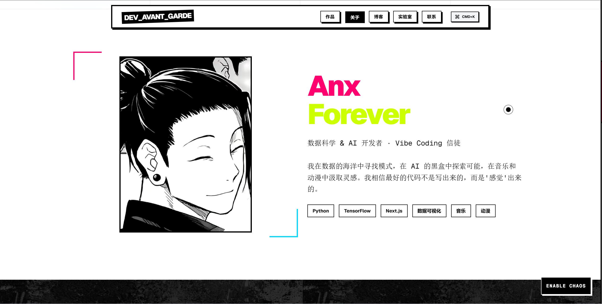

<p align="center">
  
</p>

<h1 align="center">Anx Forever Blog</h1>

<p align="center">
  <strong>一个采用 Neo-Brutalist 设计风格的前卫程序员作品集博客</strong>
</p>

<p align="center">
  <a href="https://anxforever-blog.vercel.app">
    
  </a>
  <a href="https://nextjs.org/">
    
  </a>
  <a href="https://www.typescriptlang.org/">
    
  </a>
  <a href="./LICENSE">
    
  </a>
</p>

<p align="center">
  <a href="#-特性">特性</a> •
  <a href="#-在线预览">预览</a> •
  <a href="#-快速开始">快速开始</a> •
  <a href="#-技术栈">技术栈</a> •
  <a href="#-项目结构">结构</a> •
  <a href="#-贡献">贡献</a>
</p>

---

## 📖 项目简介

这是我的**第一个开源项目**！🎉

作为一名数据科学与 AI 开发者，我一直想要一个能够展示我作品和想法的个人空间。这个博客不仅是一个作品集，更是我探索前端创意编程的实验场。

我选择了 **Neo-Brutalism（新野兽派）** 设计风格——大胆的边框、强烈的阴影、高对比度的配色——因为我相信好的设计应该有态度、有个性。

如果你也喜欢这种风格，或者想要一个独特的个人博客，欢迎 Fork 并根据自己的需要进行定制！

## ✨ 特性

### 🎨 设计亮点

- **Neo-Brutalist 风格** - 大胆的边框、硬阴影、高对比度配色，拒绝平庸
- **Chaos Mode** - 独特的混乱模式切换，一键体验不一样的视觉冲击
- **自定义光标** - 独特的鼠标跟随效果，细节见真章

### ⚡ 交互体验

- **Command Palette** - 使用 `Cmd/Ctrl + K` 快速导航，效率至上
- **页面转场动画** - 基于 Framer Motion 的流畅过渡效果
- **响应式设计** - 完美适配从手机到桌面的各种屏幕

### 🔬 实验性功能

- **物理引擎布局** - 基于 Matter.js 的实验性交互组件
- **音频反应粒子** - Web Audio API 驱动的视觉效果
- **生成式排版** - 鼠标交互的动态文字效果

## 🌐 在线预览

访问 **[anxforever-blog.vercel.app](https://anxforever-blog.vercel.app)** 查看在线效果。

### 页面截图

| 首页 | 关于页 | 作品页 |
|:---:|:---:|:---:|
|  |  |  |

## 🚀 快速开始

### 环境要求

- **Node.js** >= 20.9.0（必需）
- **npm** 或 **pnpm**

### 安装步骤

```bash
# 1. 克隆仓库
git clone https://github.com/AnxForever/v0-avant-garde-programmer-blog.git

# 2. 进入目录
cd v0-avant-garde-programmer-blog

# 3. 安装依赖
npm install

# 4. 启动开发服务器
npm run dev
```

打开 [http://localhost:3000](http://localhost:3000) 即可看到效果！

### 常用命令

```bash
npm run dev      # 启动开发服务器
npm run build    # 生产构建
npm start        # 启动生产服务器
npm run lint     # 代码检查
npm test         # 运行测试
```

## 🛠️ 技术栈

### 核心框架

| 技术 | 版本 | 说明 |
|------|------|------|
| [Next.js](https://nextjs.org/) | 16.x | React 全栈框架，使用 App Router |
| [React](https://react.dev/) | 19.x | UI 库 |
| [TypeScript](https://www.typescriptlang.org/) | 5.x | 类型安全的 JavaScript |
| [Tailwind CSS](https://tailwindcss.com/) | 4.x | 原子化 CSS 框架 |

### 动画与交互

| 技术 | 说明 |
|------|------|
| [Framer Motion](https://www.framer.com/motion/) | 声明式动画库 |
| [Matter.js](https://brm.io/matter-js/) | 2D 物理引擎 |
| Web Audio API | 音频可视化 |

### UI 组件

| 技术 | 说明 |
|------|------|
| [Radix UI](https://www.radix-ui.com/) | 无障碍组件基础库 |
| [shadcn/ui](https://ui.shadcn.com/) | 可复用组件集合 |
| [Lucide Icons](https://lucide.dev/) | 图标库 |

## 📁 项目结构

```
v0-avant-garde-programmer-blog/
├── app/                        # Next.js App Router
│   ├── page.tsx               # 首页
│   ├── about/                 # 关于页面
│   ├── blog/                  # 博客
│   │   ├── page.tsx          # 博客列表
│   │   └── [slug]/           # 博客详情（动态路由）
│   ├── work/                  # 作品展示
│   │   ├── page.tsx          # 作品列表
│   │   └── [slug]/           # 作品详情（动态路由）
│   ├── lab/                   # 实验室
│   │   ├── page.tsx          # 实验列表
│   │   └── [slug]/           # 实验详情（动态路由）
│   ├── contact/               # 联系页面
│   ├── layout.tsx             # 根布局
│   ├── template.tsx           # 页面转场模板
│   └── globals.css            # 全局样式
├── components/                 # React 组件
│   ├── nav.tsx                # 导航栏
│   ├── footer.tsx             # 页脚
│   ├── hero.tsx               # 首页 Hero
│   ├── command-palette.tsx    # 命令面板
│   ├── custom-cursor.tsx      # 自定义光标
│   ├── chaos-mode-toggle.tsx  # 混乱模式切换
│   ├── experiments/           # 实验性组件
│   │   ├── audio-reactive-particles.tsx
│   │   ├── generative-typography.tsx
│   │   └── physics-based-layout.tsx
│   └── ui/                    # UI 基础组件
├── lib/                        # 工具函数
│   ├── data.ts                # 内容数据
│   └── utils.ts               # 通用工具
├── public/                     # 静态资源
└── ...配置文件
```

## 🎨 设计原则

本项目采用 **Neo-Brutalism（新野兽派）** 设计风格：

| 原则 | 实现方式 |
|------|----------|
| **粗边框** | 所有卡片/按钮使用 2px+ 黑色边框 |
| **硬阴影** | 使用 `shadow-[4px_4px_0px_0px_rgba(0,0,0,1)]` 创建偏移阴影 |
| **高对比度** | 黑白为主色调，配合 Pink、Green、Blue、Yellow 强调色 |
| **几何形状** | 避免圆角，使用直角矩形 |
| **大胆排版** | 大字号、粗字重（font-black）、宽字距（tracking-widest） |

### 主题色彩

```css
--accent-pink:   #FF6B6B
--accent-green:  #4ECDC4
--accent-blue:   #45B7D1
--accent-yellow: #F7DC6F
```

## 🔧 自定义配置

### 修改内容

编辑 `lib/data.ts` 文件来管理你的内容：

```typescript
// 博客文章
export const posts = [
  {
    id: 1,
    title: "文章标题",
    excerpt: "文章摘要...",
    slug: "article-slug",
    // ...
  },
]

// 作品项目
export const projects = [...]

// 实验室项目
export const experiments = [...]
```

### 修改样式

- **全局样式**：`app/globals.css`
- **Tailwind 配置**：`tailwind.config.ts`
- **主题色彩**：搜索 `accent-pink`、`accent-green` 等关键词

### 添加新页面

```bash
# 在 app/ 目录下创建新路由
mkdir app/new-page
touch app/new-page/page.tsx
```

## 📝 开发路线图

- [ ] 添加博客评论系统（Giscus）
- [ ] 集成 CMS（Contentful / Sanity / Notion）
- [ ] 添加 RSS 订阅功能
- [ ] 国际化支持（i18n）
- [ ] 深色模式
- [ ] SEO 优化增强
- [ ] 性能优化（图片懒加载、代码分割）

## 🤝 贡献

这是我的第一个开源项目，非常欢迎各种形式的贡献！

### 如何贡献

1. **Fork** 本仓库
2. 创建特性分支：`git checkout -b feature/AmazingFeature`
3. 提交更改：`git commit -m 'feat: 添加某功能'`
4. 推送分支：`git push origin feature/AmazingFeature`
5. 提交 **Pull Request**

详细的贡献指南请查看 [CONTRIBUTING.md](./CONTRIBUTING.md)。

### 反馈问题

如果发现 Bug 或有功能建议，欢迎 [创建 Issue](https://github.com/AnxForever/v0-avant-garde-programmer-blog/issues)。

## 📄 许可证

本项目基于 [MIT License](./LICENSE) 开源，你可以自由使用、修改和分发。

## 🙏 致谢

- [v0.app](https://v0.app) - 初始项目生成
- [Vercel](https://vercel.com) - 部署托管
- [shadcn/ui](https://ui.shadcn.com) - UI 组件参考
- [Radix UI](https://www.radix-ui.com/) - 无障碍组件基础
- 所有为开源社区做出贡献的开发者们

## 📬 联系方式

- **Email**: anxforever@qq.com
- **GitHub**: [@AnxForever](https://github.com/AnxForever)

---

<p align="center">
  <strong>如果这个项目对你有帮助，请给个 ⭐ Star 支持一下！</strong>
</p>

<p align="center">
  Made with ❤️ by <a href="https://github.com/AnxForever">Anx Forever</a>
</p>
